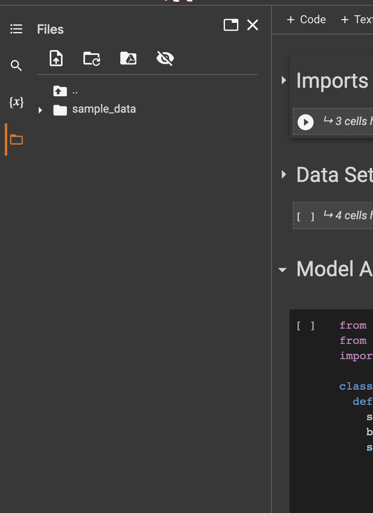

# FicEmbed 🪄
To reproduce this, we recommend using Google Colab. The entirety of documents you need are in the `peer_review_submission` folder. If you have a GPU, then feel free to implement these steps locally as well.
- Open `peer_review_submission/CS_182_Final_Project_RNN_Style_Architecture.ipynb`
- Into the accessible documents in the Colab, add `peer_review_submission/rj_vadr_bert.csv` to the local memory
  - You can put the downloaded `csv` here.
  - </img>
- Run the colab!

If there are data import errors, this is probably because the `csv` is not accessible. Please confirm that it is in local memory!

